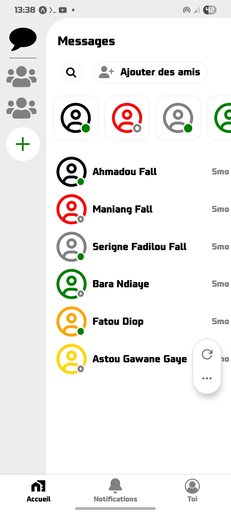
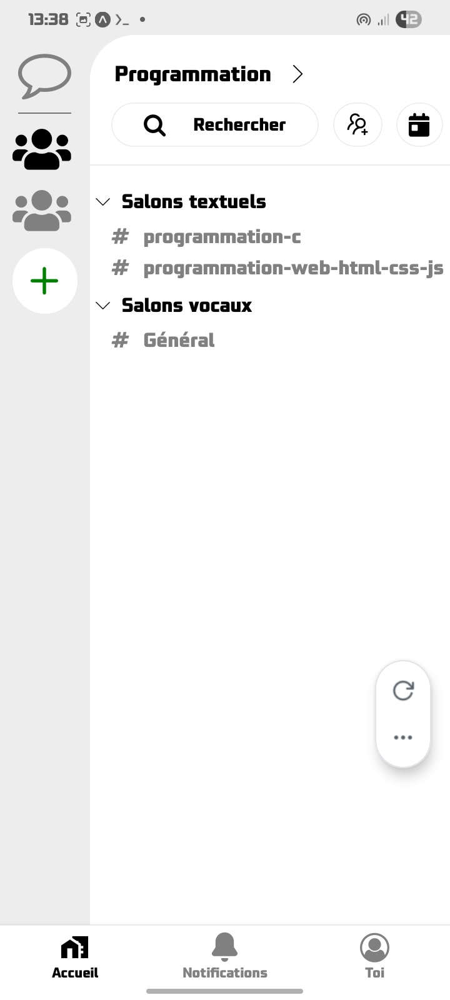
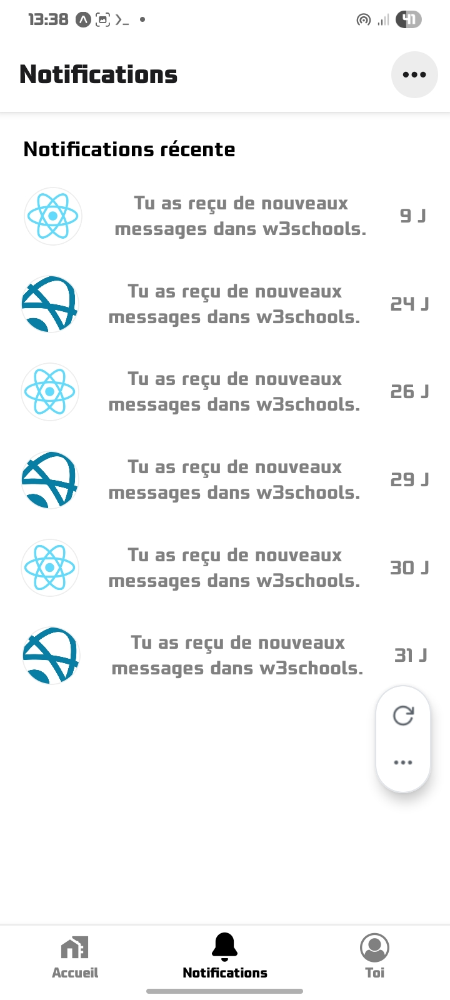
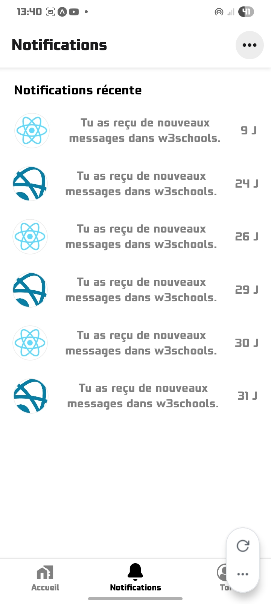
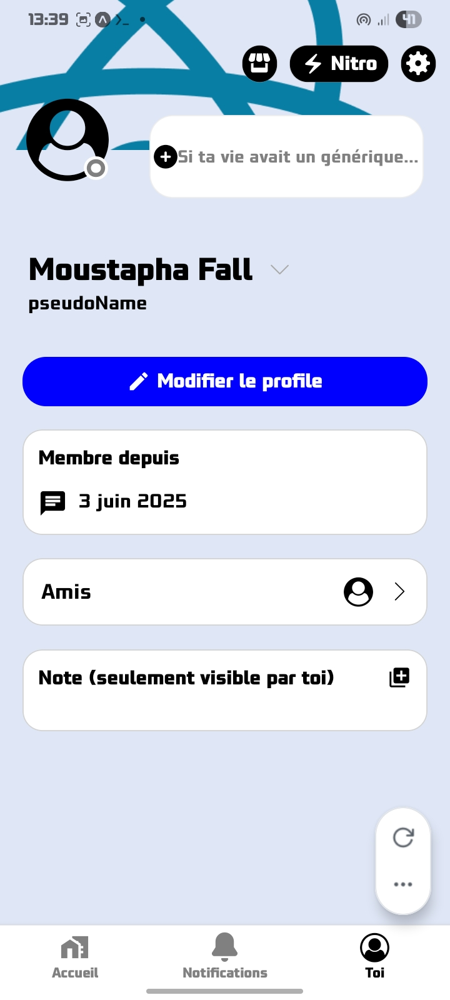
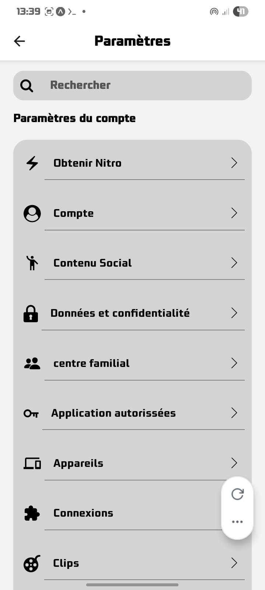
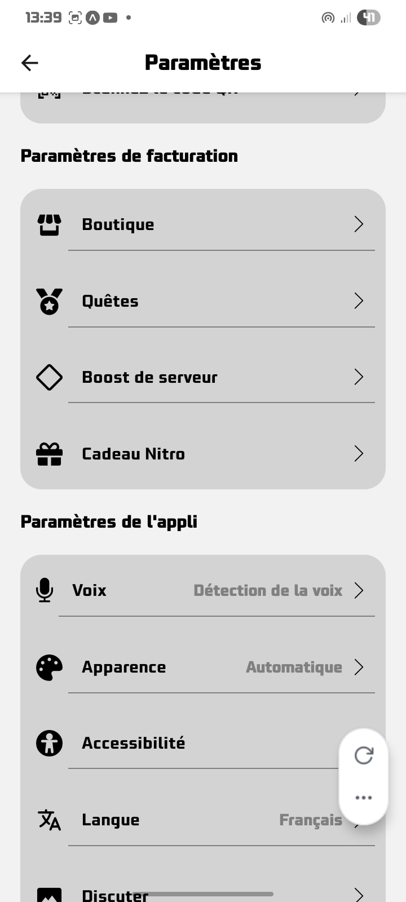
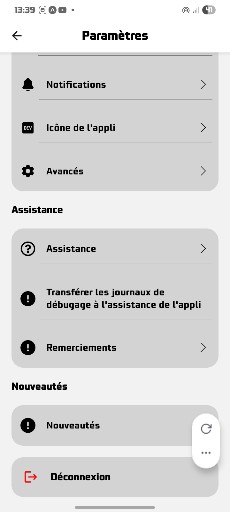

Discord-Clone UI (Expo – React Native)

A mobile reproduction of the Discord user interface, built with Expo and React Native.
The project focuses only on the visual layout and interactions, without implementing real backend features.

Features

Recreated Discord-inspired layout

### Home screens

### Notifications screens

### Profile screens

### Settings screens

Smooth transitions and clean styling

Responsive design for mobile screens

Tech Stack

Expo + React Native

TypeScript

Expo Router

React Native Reanimated (optional for animations)

Project Structure

/app
/(tabs)
/screens
/components
/ui
/home_components

Installation

git clone https://github.com/tapha0540/discord-clone
cd discord-clone
npm install
npx expo start

About the Project

This project recreates the Discord mobile interface to practice UI building, navigation, and component composition in React Native.
It can serve as a base for future implementations such as real-time messaging or authentication.
